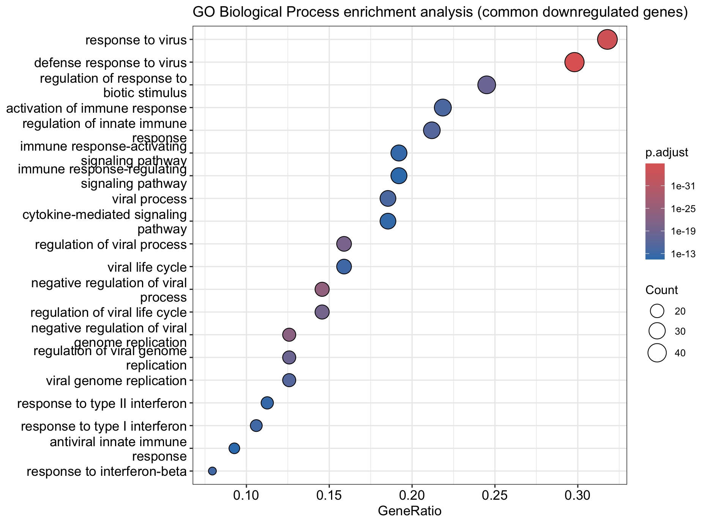
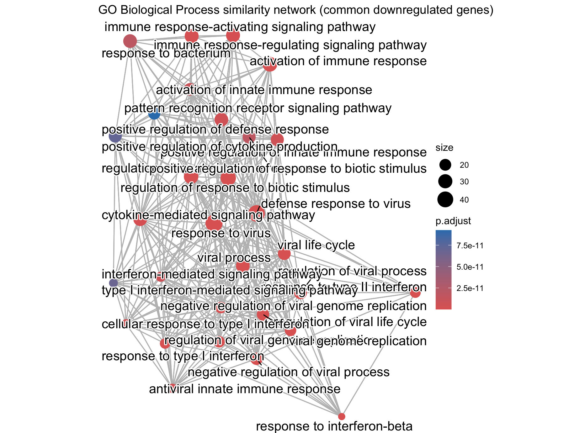
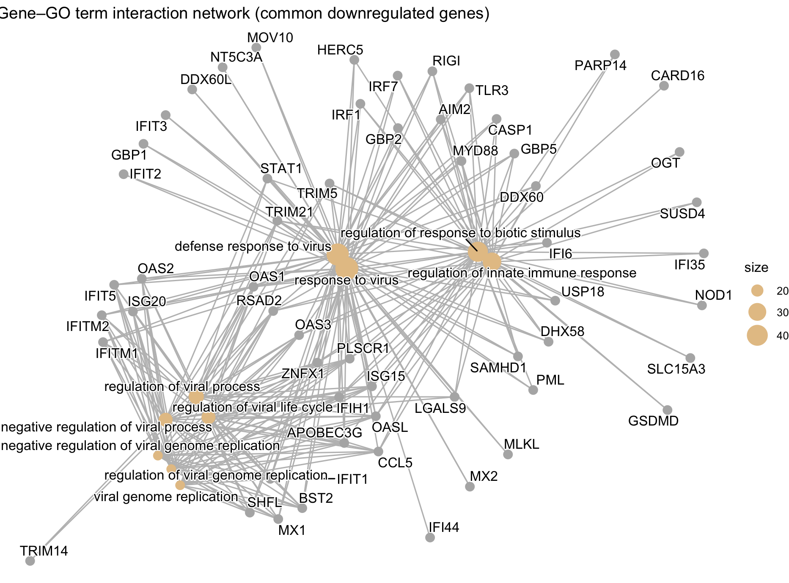

# End-to-End Bulk RNA-seq Analysis Workflow (DESeq2) for Differential Expression and Functional Interpretation

   

------------------------------------------------------------------------

# 💼 Bioinformatics Service Demonstration

This repository presents a complete end-to-end Bulk RNA-seq analysis workflow implemented in R using Bioconductor standards.

The pipeline is designed as a **reproducible and client-oriented example of differential expression and functional enrichment analysis**.

------------------------------------------------------------------------

## 🧬 Analysis capabilities demonstrated

This project includes:

-   Differential gene expression analysis (DESeq2)
-   Quality control and exploratory data analysis (PCA, clustering, heatmaps)
-   Functional enrichment analysis:
    -   Gene Ontology (BP, MF, CC)
    -   KEGG pathway analysis
    -   Reactome pathway analysis
-   Publication-ready visualization of results
-   Biological interpretation of transcriptomic changes

------------------------------------------------------------------------

## 📤 Deliverables

-   Differential expression tables (log2FC, FDR)
-   Gene Ontology enrichment results
-   KEGG and Reactome pathway enrichment
-   PCA and sample QC plots
-   Volcano plots and MA plots
-   Publication-ready figures (high-resolution, journal-ready)

------------------------------------------------------------------------

## 🎯 Use Cases

This workflow can be applied to:

-   Academic research projects
-   Preclinical transcriptomic studies
-   RNA-seq data reanalysis
-   Validation of experimental results
-   Support for manuscript preparation (figures and analysis)

------------------------------------------------------------------------

# 📊 Case Study: OGT Knockdown RNA-seq Dataset

-   Organism: *Homo sapiens*
-   Cell line: KGN ovarian granulosa cells
-   Condition: siOGT1 / siOGT2 vs siNC
-   Replicates: 2 per condition
-   Dataset: NCBI GEO GSE316021 / PRJNA1400483

------------------------------------------------------------------------

# 🧬 Biological Context

This study investigates the transcriptional consequences of **OGT (O-GlcNAc transferase) knockdown**, a key enzyme involved in:

-   transcriptional regulation
-   stress response
-   metabolic signaling
-   post-translational modification (O-GlcNAcylation)

------------------------------------------------------------------------

# 📌 Key Results

-   Identification of statistically significant DEGs across two independent siRNA knockdowns
-   Strong concordance between siOGT1 and siOGT2 conditions
-   Clear separation between conditions in PCA analysis
-   Functional enrichment highlights:
    -   transcriptional regulation
    -   cellular stress response
    -   metabolic and signaling pathways

------------------------------------------------------------------------

# ⚙️ Analysis Pipeline

## Upstream processing

1.  SRA data retrieval
2.  Quality control (FastQC, MultiQC)
3.  Adapter trimming (Trimmomatic)
4.  Alignment (HISAT2)
5.  Gene quantification (featureCounts)

------------------------------------------------------------------------

## Downstream analysis (R / Bioconductor)

### 1. Data preprocessing

-   Raw count matrix construction
-   Metadata curation and sample annotation

### 2. Differential expression analysis (DESeq2)

-   Median-of-ratios normalization
-   Dispersion estimation
-   Wald test for differential expression
-   FDR correction (Benjamini–Hochberg)

### 3. Exploratory data analysis

-   PCA on VST-transformed counts
-   Sample clustering
-   Expression distribution diagnostics

### 4. Functional enrichment analysis

-   Gene Ontology (BP, MF, CC)
-   KEGG pathway enrichment
-   Reactome pathway enrichment

------------------------------------------------------------------------

# 📁 Project Structure

``` text
Bulk-RNA-Seq-pipeline/
├── README.Rmd
├── README.md
├── reports/
│   ├── report.Rmd
│   ├── report.md
│   ├── report.html
│   ├── report.pdf
├── upstream/
│   ├── report/
│   │   ├── fastqc/
│   │   ├── featureCounts/
│   │   ├── MultiQC/
│   │   ├── featureCounts/
│   │   └── hisat2/
│   └── script
├── downstream/
│   ├── objects/
│   ├── plots/
│   │   ├── DE/
│   │   ├── EDA/
│   │   ├── ORA/
│   │   ├── QC/
│   ├── scripts/
│   │   ├── 01_DESeq2_object.r
│   │   ├── 02_Exploratory_Data_Analysis.r
│   │   ├── 03_Differentially_Expressed_Genes.r
│   │   ├── 04_GO_PathwayEnrichment.r
```

------------------------------------------------------------------------

# 📤 Main results

This section shows the type of results a client would receive.

## 📈 Visual Outputs

### PCA of samples


### Sample distance heatmap


### Volcano plot (siOGT1 vs Control)


### Heatmap of DEGs


### Gene Ontology – Biological Process

**Dotplot** 

**Similarity network (emapplot)** 

**Gene–term network (cnetplot)** 

------------------------------------------------------------------------

# 🔁 Reproducibility

-   Fully reproducible Bioconductor workflow
-   Separation of:
    -   raw counts (statistical analysis)
    -   transformed counts (visualization only)
-   Standard DESeq2 pipeline following Bioconductor best practices
-   Modular and reusable R scripts

------------------------------------------------------------------------

# 🧠 Biological Interpretation

Results are consistent with known roles of OGT in:

-   transcriptional regulation
-   stress response
-   metabolic adaptation
-   cellular signaling pathways

------------------------------------------------------------------------

# References

1.  **BioProject:** [PRJNA1400483](https://www.ncbi.nlm.nih.gov/bioproject/PRJNA1400483)\
2.  **RNA-seq best practices:** [Bioconductor RNA-seq workflow](https://www.bioconductor.org/help/workflows/rnaseqGene/)

## Tools

-   R (v4.5.1)
-   Bioconductor (v3.x)

### Core packages

-   DESeq2
-   clusterProfiler
-   ReactomePA
-   org.Hs.eg.db

### Additional tools

-   HISAT2

-   featureCounts

-   FastQC / MultiQC

-   Trimmomatic

------------------------------------------------------------------------

# 📬 Contact

This project is part of a bioinformatics portfolio focused on delivering **reproducible, high-quality RNA-seq analyses** for research and preclinical applications.

I am available for freelance bioinformatics projects, including:

-   End-to-end Bulk RNA-seq analysis (from raw counts to biological interpretation)
-   Differential expression analysis (DESeq2 / edgeR)
-   Functional enrichment (GO, KEGG, Reactome)
-   Data visualization and publication-ready figures
-   Reproducible and well-documented analysis pipelines

💡 **If you have RNA-seq data and need:**

-   reliable differential expression results
-   clear biological interpretation
-   professional figures for publication or reports

I can help translate your data into actionable insights.

🚀 Available for short-term and long-term collaborations.

📩 **Get in touch:**

-   GitHub: <https://github.com/DaviMacca08>\
-   Email: davide_maccarrone\@icloud.com
