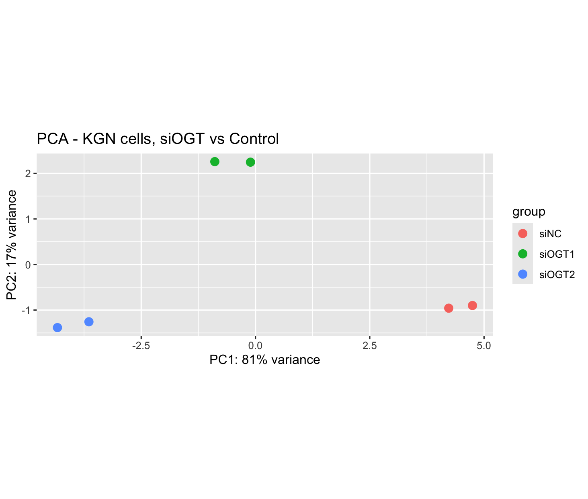
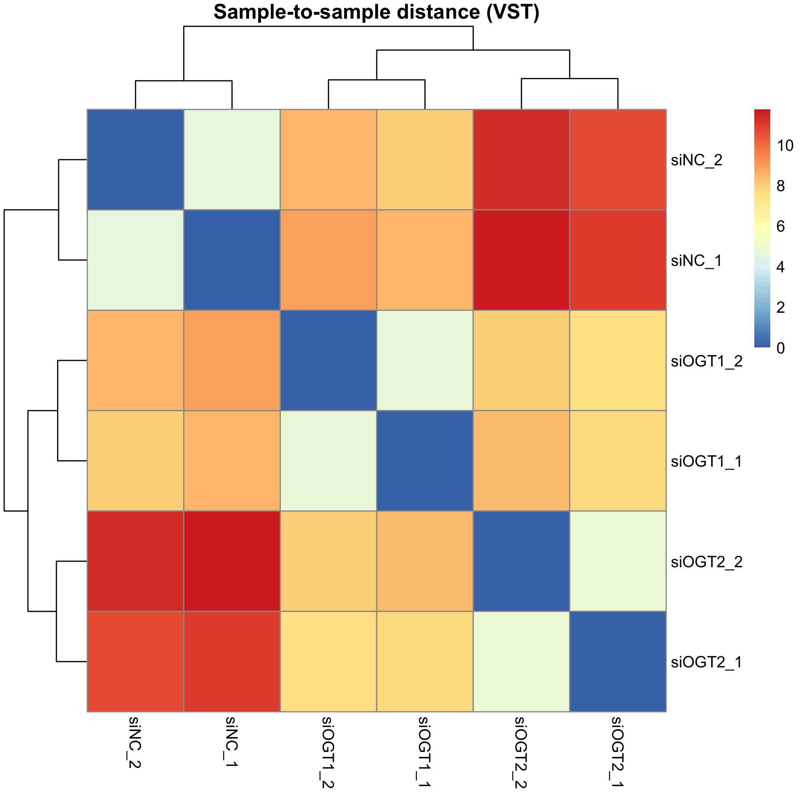
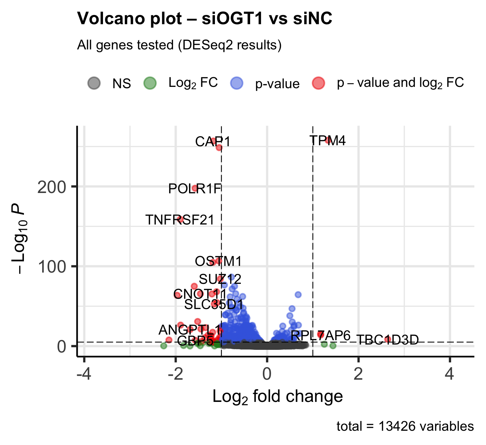
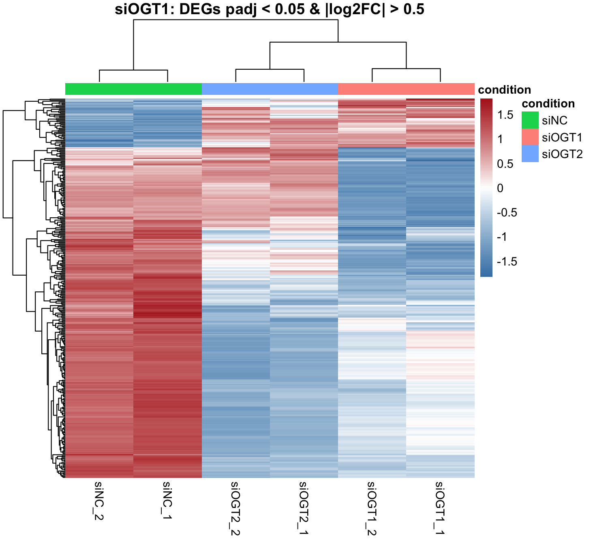
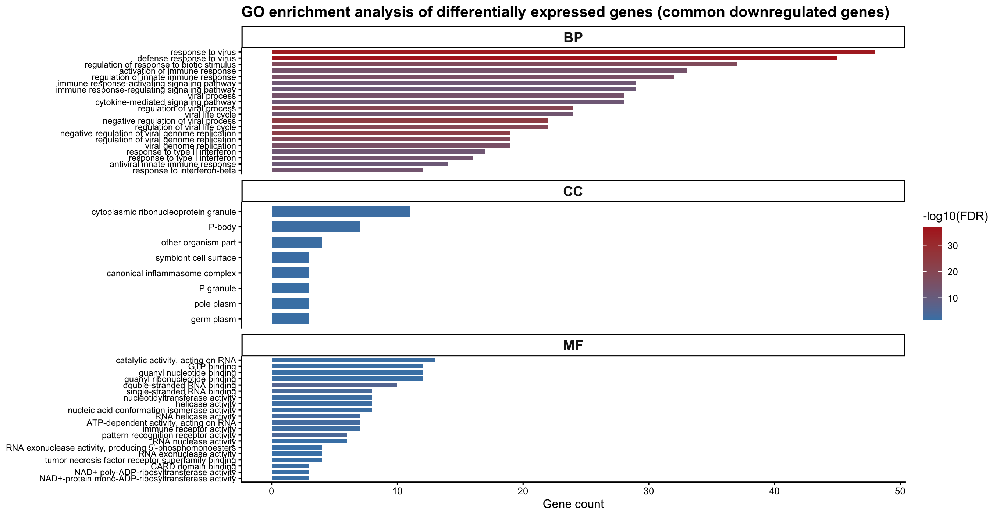
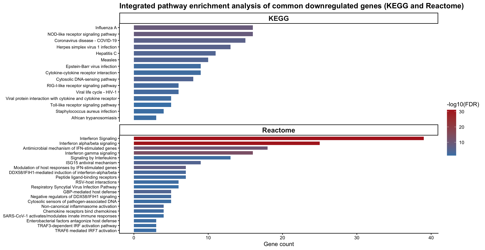

# 1. Executive Summary

This report presents a comprehensive bulk RNA-seq analysis of human
ovarian granulosa (KGN) cells following OGT (O-GlcNAc transferase)
knockdown.

The analysis investigates transcriptional changes induced by OGT
silencing using two independent siRNA treatments (siOGT1 and siOGT2)
compared to control conditions.

Differential expression analysis identified a consistent set of
significantly regulated genes across both knockdown conditions,
indicating robust transcriptional effects associated with OGT depletion.

Functional enrichment analysis revealed significant modulation of
pathways related to transcriptional regulation, cellular stress
response, immune signaling, and metabolic processes.

Overall, these findings highlight the central role of OGT in regulating
gene expression programs and cellular signaling pathways in ovarian
granulosa cells.

------------------------------------------------------------------------

# 2. Experimental Design

The dataset consists of 6 RNA-seq samples derived from human ovarian
granulosa (KGN) cells:

<table>
<colgroup>
<col style="width: 15%" />
<col style="width: 16%" />
<col style="width: 68%" />
</colgroup>
<thead>
<tr>
<th>Condition</th>
<th>Replicates</th>
<th>Description</th>
</tr>
</thead>
<tbody>
<tr>
<td>siNC</td>
<td>2</td>
<td>Control cells treated with non-targeting siRNA</td>
</tr>
<tr>
<td>siOGT1</td>
<td>2</td>
<td>Cells treated with OGT-targeting siRNA (siOGT1)</td>
</tr>
<tr>
<td>siOGT2</td>
<td>2</td>
<td>Cells treated with OGT-targeting siRNA (siOGT2)</td>
</tr>
</tbody>
</table>

Each condition includes two biological replicates.

No major batch effects were reported in the original study.

------------------------------------------------------------------------

# 3. Data Processing Workflow

RNA-seq preprocessing was performed using a standardized and
reproducible pipeline:

-   Quality control: FastQC and MultiQC
-   Adapter trimming: Trimmomatic
-   Alignment to the human reference genome: HISAT2
-   Gene-level quantification: featureCounts

Raw count data were retained for all downstream statistical analyses, in
accordance with Bioconductor best practices.

The analysis was conducted using established Bioconductor workflows,
ensuring reproducibility, methodological rigor, and adherence to widely
accepted standards in RNA-seq data analysis.

## 3.1 Statistical framework

Differential expression analysis was performed using DESeq2, which
models count data using a negative binomial distribution.

Normalization was carried out using the median-of-ratios method to
account for differences in library size and sequencing depth across
samples. This method is robust to genes with high counts and avoids
biases introduced by highly expressed features.

Gene-wise dispersion estimates were calculated and moderated using
empirical Bayes shrinkage.

Statistical significance was determined using the Benjamini–Hochberg
false discovery rate (FDR) correction to control for multiple hypothesis
testing.

------------------------------------------------------------------------

# 4. Exploratory Data Analysis (EDA)

## 4.1 Principal Component Analysis (PCA)

PCA was used to assess global transcriptional differences between
conditions.

PCA revealed a clear separation between control (siNC) and OGT knockdown
samples (siOGT1 and siOGT2), indicating strong transcriptional changes
induced by OGT depletion.

## 4.2 Sample Clustering

Sample-distance heatmap was performed to assess sample similarity.

# 5. Differential Expression Analysis (DEGs)

Differential expression analysis was performed using DESeq2 with
median-of-ratios method for normalization.

**Criteria for significance:**

    ## - FDR < 0.05

    ## - |log2FC| > 0.5

## 5.1 Summary of DEGs

    ## === Differential Expression Results ===

    ## [siOGT1 vs Control]

    ## Total DEGs: 351 (Up: 45 | Down: 306)

    ## [siOGT2 vs Control]

    ## Total DEGs: 599 (Up: 127 | Down: 472)

    ## [Common DEGs]

    ## Total DEGs: 206 (Up: 24 | Down: 182)

## 5.2 Volcano Plot of DEGs

## 5.3 Heatmap of DEGs

# 6. Functional Enrichment Analysis

Functional enrichment analysis was performed using GO, KEGG and Reactome
databases, only on downregulated genes in common.

## 6.1 Gene Ontology terms

### **Biological Process**

-   Response to virus
-   Defense response to virus
-   Regulation of response to biotic stimulus

### **Molecular Functions**

-   Catalytic activity, acting on RNA
-   GTP binding
-   Guanyl nucleotide binding

### **Cellular Component**

-   Cytoplasmic ribonucleoprotein granule
-   P-body
-   Symbiont cell surface

## 🧠 Biological interpretation (GO enrichment)

The Gene Ontology enrichment analysis highlights a strong involvement of
antiviral and immune-related biological processes following OGT
knockdown.

The most significantly enriched Biological Process terms include
*response to virus*, *defense response to virus*, and *regulation of
response to biotic stimulus*. These results suggest that OGT depletion
leads to a marked downregulation of genes involved in innate immune
responses.

At the Molecular Function level, enrichment of terms such as *catalytic
activity acting on RNA* and *GTP binding* indicates perturbation of RNA
metabolism and signaling processes. These functions are typically
associated with RNA processing enzymes and regulatory GTP-binding
proteins, which play key roles in stress responses and immune signaling.

Cellular Component enrichment further supports this observation, with
significant terms such as *cytoplasmic ribonucleoprotein granule* and
*P-body*. These structures are known to be involved in mRNA storage,
degradation, and translational control, particularly under stress or
antiviral conditions.

Overall, the GO analysis suggests that OGT knockdown disrupts RNA
regulatory mechanisms and impairs antiviral defense programs,
potentially affecting post-transcriptional gene regulation and cellular
stress adaptation.

## 6.2 KEGG Pathways

Significant pathways include:

-   HInfluenza A
-   NOD−like receptor signaling pathway
-   Coronavirus disease − COVID−19

## 6.3 Reactome Pathways

-   Interferon Signaling
-   Interferon alpha/beta signaling
-   Antimicrobial mechanism of IFN−stimulated genes

## 🧠 Biological interpretation (KEGG and Reactome pathway)

Pathway enrichment analysis using KEGG and Reactome databases reveals a
strong and coherent suppression of interferon-mediated and innate immune
signaling pathways following OGT knockdown.

KEGG pathways such as *Influenza A*, *NOD-like receptor signaling*, and
*Coronavirus disease (COVID-19)* are significantly enriched. Although
these pathways are named after specific infections, they largely
represent canonical antiviral response pathways driven by interferons
and innate immune signaling cascades.

Reactome analysis further refines this interpretation, highlighting
*Interferon Signaling*, *Interferon alpha/beta signaling*, and
*Antimicrobial mechanisms of interferon-stimulated genes (ISGs)* as the
most significantly affected pathways.

Taken together, these results strongly indicate that OGT plays a
critical role in maintaining interferon signaling and antiviral defense
mechanisms in ovarian granulosa cells.

The consistent downregulation of interferon-related pathways suggests
that OGT depletion may impair the activation of interferon-stimulated
genes, potentially reducing the cell’s ability to respond to external
stressors and viral-like stimuli.

These findings are in agreement with previous studies indicating that
O-GlcNAcylation regulates key transcription factors and signaling
proteins involved in immune responses and cellular stress pathways.

Overall, the data support a model in which OGT acts as an important
regulator of immune signaling and cellular defense, and its inhibition
leads to a coordinated suppression of antiviral and stress-response
transcriptional programs.

## 7. Biological Conclusions and Impact

This analysis demonstrates that OGT (O-GlcNAc transferase) plays a
central role in regulating transcriptional programs in human ovarian
granulosa cells.

The consistent identification of differentially expressed genes across
two independent knockdown conditions (siOGT1 and siOGT2) confirms the
robustness of the observed transcriptional changes and supports a direct
effect of OGT depletion on gene expression.

Functional enrichment analyses reveal that OGT knockdown leads to a
coordinated downregulation of pathways involved in antiviral defense and
interferon signaling. In particular, the suppression of
interferon-stimulated genes and innate immune pathways suggests that OGT
is required for maintaining an active cellular defense response.

In addition, the enrichment of RNA-related molecular functions and
ribonucleoprotein-associated cellular components indicates that OGT may
contribute to post-transcriptional regulation, including mRNA
processing, stability, and translation control under stress conditions.

These findings are consistent with the known role of O-GlcNAcylation in
modulating transcription factors, signaling proteins, and
stress-response pathways. The observed transcriptional reprogramming
suggests that OGT acts as a key integrator of cellular signaling and
gene regulation in ovarian granulosa cells.

From a biological perspective, the impairment of immune and
stress-response pathways may have important implications for ovarian
function, cellular homeostasis, and response to environmental stimuli.

From a translational perspective, these results highlight OGT as a
potential regulatory node linking metabolic signaling, gene expression
control, and cellular stress adaptation. Further investigation may help
clarify its role in ovarian physiology and its potential involvement in
pathological conditions.

Overall, this analysis demonstrates how a reproducible RNA-seq workflow
can generate biologically meaningful insights and support data-driven
research decisions.

These results can guide further experimental validation, including
targeted gene expression assays, pathway-focused studies, or functional
characterization of interferon-related mechanisms.
